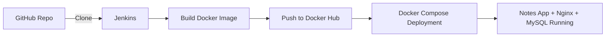

# 📝 Notes App CI/CD with Jenkins & Docker

This project demonstrates a **fully automated CI/CD pipeline** for a Dockerized Notes Application using **Jenkins, Docker, Docker Hub, and Docker Compose**.  

The pipeline takes the application code, builds a Docker image, pushes it to Docker Hub, and deploys it with **Nginx, MySQL, and the Notes App container**.

---

## 🔧 Tech Stack
- **CI/CD:** Jenkins  
- **Containers:** Docker, Docker Hub  
- **Orchestration:** Docker Compose  
- **Reverse Proxy:** Nginx  
- **Database:** MySQL  
- **App:** Django (Python backend), React + Node.js frontend  

---

## 🚀 CI/CD Pipeline Flow
1. **Clone** → Jenkins pulls code from GitHub.  
2. **Build** → Docker image is built from `Dockerfile`.  
3. **Push** → Image is tagged & pushed to Docker Hub.  
4. **Deploy** → Docker Compose runs 3 services:  
   - `nginx` → reverse proxy  
   - `mysql` → database  
   - `notes-app` → application container (pulled from Docker Hub)  

---

## 📂 Repository Structure
```

├── api/                  # Backend (Python/Django APIs)
├── mynotes/              # Frontend (React/Node.js)
├── notesapp/             # App logic
├── nginx/                # Nginx reverse proxy configs
├── staticfiles/          # Static assets
├── Dockerfile            # Build notes-app container
├── docker-compose.yml    # Orchestrates nginx, mysql, notes-app
├── Jenkinsfile           # CI/CD pipeline definition
├── .env                  # Environment variables
├── requirements.txt      # Python dependencies
└── README.md             # Documentation (this file)

````

---

## 🛠️ Jenkinsfile (Pipeline Definition)
```groovy
pipeline {
    agent any

    stages {
        stage("Clone") {
            steps {
                echo "Clone the code from the repo"
                git url: "https://github.com/abdulraheem381/notes-app-cicd-docker", branch: "main"
            }
        }

        stage("Build") {
            steps {
                echo "This step will build docker image"
                sh "docker build -t notes-app:v1 ."
            }
        }

        stage("Push") {
            steps {
                echo "Push the image to docker hub!"
                withCredentials([usernamePassword(
                    credentialsId: "dockerhub",
                    usernameVariable: "dockerhubUser",
                    passwordVariable: "dockerhubPass")]) {
                    
                    sh 'echo $dockerhubPass | docker login -u $dockerhubUser --password-stdin'
                    sh "docker image tag notes-app:v1 ${dockerhubUser}/notes-app:latest"
                    sh "docker push ${dockerhubUser}/notes-app:latest"
                }
            }
        }

        stage("Deploy") {
            steps {
                echo "Run the container"
                sh "docker compose up -d"
            }
        }
    }
}
````

---

## 🖼️ Pipeline Architecture



---

## ⚡ How to Run Locally

1. Clone the repo:

   ```bash
   git clone https://github.com/abdulraheem381/notes-app-cicd-docker.git
   cd notes-app-cicd-docker
   ```

2. Start services:

   ```bash
   docker compose up -d
   ```

3. Access the app at:
   👉 [http://localhost:8000](http://localhost:8000)

---

## 📸 Screenshots


---

## 🏆 Key Highlights

* End-to-end **CI/CD Automation** (Code → Build → Push → Deploy).
* **Infrastructure as Code** using Docker Compose.
* Scalable, portable, and production-ready workflow.

---

## 📖 Learning Outcomes

* Containerization with Docker.
* Automated pipelines using Jenkins.
* Deploying multi-container apps with Docker Compose.


```
